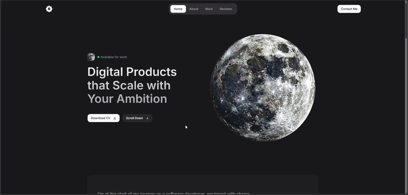

# Personal Portfolio

A clean, modern, and highly interactive personal portfolio website designed to showcase my projects, skills, and experience as a software developer.

🔗 **Live Demo:** [https://aymenghris.vercel.app](https://aymenghris.vercel.app)  

## 📸 Preview

## ✨ Key Features
- **Smooth Scrolling & Navigation:** Powered by Lenis for buttery-smooth inertial scrolling, coupled with active section tracking using a custom ScrollSpy component.
- **Dynamic Reveal Animations:** Utilizes GSAP and ScrollTrigger to create fluid, scroll-driven entry animations for text and card elements.
- **Curated Project Gallery:** Showcases major full-stack and front-end applications, complete with interactive tags, repository links, and live demos.
- **Fully Functional Contact Form:** Direct integration with Getform.io for secure and seamless contact queries without custom backend code.
- **Modern & Responsive Design:** Sleek dark-mode aesthetic built with Tailwind CSS, custom scrollbars, and full responsiveness across all devices.

## 🛠 Tech Stack
- **Frontend:** `Next.js` `React 19` `TypeScript` `Tailwind CSS` `GSAP` `Lenis`
- **Backend/Services:** `Getform.io`
- **Deployment:** `Vercel`

## 💡 What I Learned
- Integrating Lenis smooth scrolling with custom React hooks to manage page jumps and anchor links seamlessly.
- Orchestrating performant scroll-based reveal animations using GSAP's `ScrollTrigger` and the official `@gsap/react` package.
- Setting up lightweight, serverless contact form submissions using Getform.io, eliminating the need to maintain a custom email server.
- Structuring modular Next.js application layouts utilizing component-driven architecture for scalability and reusability.

## 👤 Contact
[LinkedIn](https://linkedin.com/in/aymenghris) • [Email](mailto:aymenghris@outlook.com) • [GitHub](https://github.com/aymenghris)
